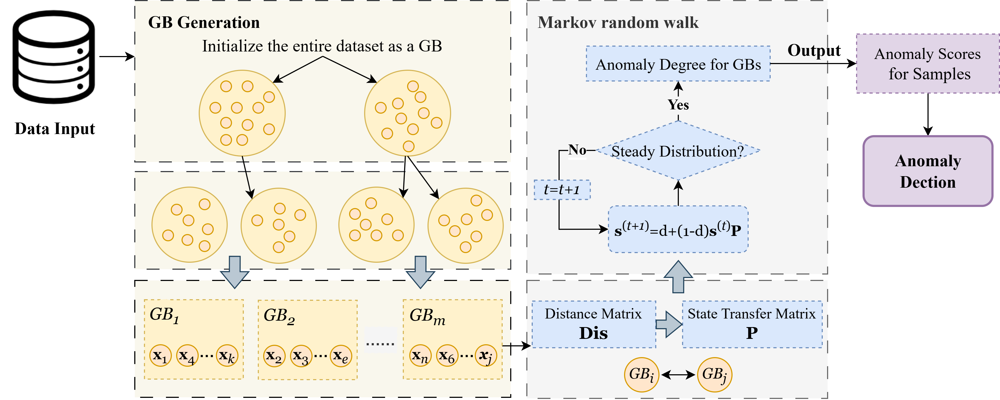

# GBRAD
Sihan Wang, **Zhong Yuan***, Shitong Cheng, Hongmei Chen, and Dezhong Peng, [Granular-ball computing-based Random Walk for anomaly detection](Paper/2025-GBRAD.pdf), Pattern Recognition, 165: 111588. (Code)

## Abstract
Anomaly detection is a key task in data mining, which has been successfully employed in many practical scenarios. However, most existing methods usually analyze the anomalous characteristics of samples at a 
single and finest granularity, which leads to high computational cost and low efficiency. As one of the significant mathematical models in the theory of granular computing, granular-ball computing can portray the 
distributional characteristics of data from a multi-granularity perspective. For this reason, this paper proposes an unsupervised anomaly detection method based on granular-ball computing. Firstly, the samples are covered 
by generating adaptive granular-balls, and the multi-granularity information represented by granular-balls with different sizes can reflect the data distribution characteristics of the corresponding region. Secondly, the 
granular-balls are used to fit the samples for constructing a state transfer matrix in Random walk. Then, the steady-state distribution is generated using iterative computation and is normalized as the degree of anomaly 
for each granular-ball. Finally, the anomaly score for each sample is computed by relating the anomaly degree of each granular-ball to the samples it covers. Comparative experiments show that the proposed anomaly 
detection method performs well on multiple datasets, demonstrating its feasibility and superiority in practical applications. The code is publicly available online at [https://github.com/optimusprimeyy/GBRAD](https://github.com/optimusprimeyy/GBRAD).

## Framework


## Usage
You can run GBRAD.py:
```
if __name__ == '__main__':
    L = 8  # Set the minimum number of samples L in the grain ball
    d = 0.35  # Set the damping factor for Markov random walk.

    data_name = 'iris_Irisvirginica_11_variant1'
    Exmaple = io.loadmat(r"datasets\\" + data_name)
    data = Exmaple['trandata'][:, :-1]  # data
    target = Exmaple['trandata'][:, -1]  # label

    samples_scores = GBRAD(data, L, d)
    print(samples_scores)
```
You can get outputs as follows:
```
out_scores =
   [0.8414522965922538, 0.8215772996541814, 0.8212994452743472, 0.8212994452743472, 0.8414522965922538, 0.9448146761615156, 0.8497201143510823, 0.8302865011080012, 0.8447433479928064, 0.8213002282806524, 0.8714455992113381, 0.8302865011080012, 0.8213002282806524, 0.8447433479928064, 0.9448146761615156, 0.9448146761615156, 0.9448146761615156, 0.8414522965922538, 0.9448146761615156, 0.8714455992113381, 0.8516102294983874, 0.8714455992113381, 0.8497201143510823, 0.8211580686768085, 0.8302865011080012, 0.8215772996541814, 0.8211580686768085, 0.8414522965922538, 0.8516102294983874, 0.8212994452743472, 0.8215772996541814, 0.8516102294983874, 0.9448146761615156, 0.9448146761615156, 0.8213002282806524, 0.8302865011080012, 0.8516102294983874, 0.8213002282806524, 0.8447433479928064, 0.8302865011080012, 0.8414522965922538, 0.8726621587737212, 0.8447433479928064, 0.8414522965922538, 0.8714455992113381, 0.8215772996541814, 0.8714455992113381, 0.8212994452743472, 0.8714455992113381, 0.8302865011080012, 0.9628318845722701, 0.9759490060215679, 0.9628318845722701, 0.9439887635266376, 0.9538157832706633, 0.9534904004237795, 0.9759490060215679, 0.9324596621627721, 0.9538157832706633, 0.9439887635266376, 0.9324596621627721, 0.9375828266570746, 0.9650190435890612, 0.9375828266570746, 0.9534904004237795, 0.9538157832706633, 0.9534939000022608, 0.9362775485702761, 0.940446560315094, 0.9650190435890612, 0.9759490060215679, 0.9479863059318013, 0.940446560315094, 0.9479863059318013, 0.9479863059318013, 0.9538157832706633, 0.9538157832706633, 0.9628318845722701, 0.9375828266570746, 0.9650190435890612, 0.9650190435890612, 0.9650190435890612, 0.9362775485702761, 0.940446560315094, 0.9534939000022608, 0.9759490060215679, 0.9628318845722701, 0.940446560315094, 0.9534904004237795, 0.9439887635266376, 0.9362775485702761, 0.9375828266570746, 0.9362775485702761, 0.9324596621627721, 0.9362775485702761, 0.9534904004237795, 0.9534904004237795, 0.9479863059318013, 0.9324596621627721, 0.9534904004237795, 1.0254724098045584, 1.0257886397494076, 1.0257886397494076, 0.9577653966538024, 1.0254724098045584, 1.0257886397494076, 1.0257886397494076, 1.0257886397494076, 1.0254724098045584, 1.0254724098045584, 1.0254724098045584]
```

## Citation
If you find GBRAD useful in your research, please consider citing:
```
@article{wang2025granular,
  title={Granular-ball computing-based Random Walk for anomaly detection},
  author={Wang, Sihan and Yuan, Zhong and Cheng, Shitong and Chen, Hongmei and Peng, Dezhong},
  journal={Pattern Recognition},
  pages={111588},
  year={2025},
  publisher={Elsevier}
}
```
## Contact
If you have any questions, please contact wangsihan0713@foxmail.com or yuanzhong@scu.edu.cn.

